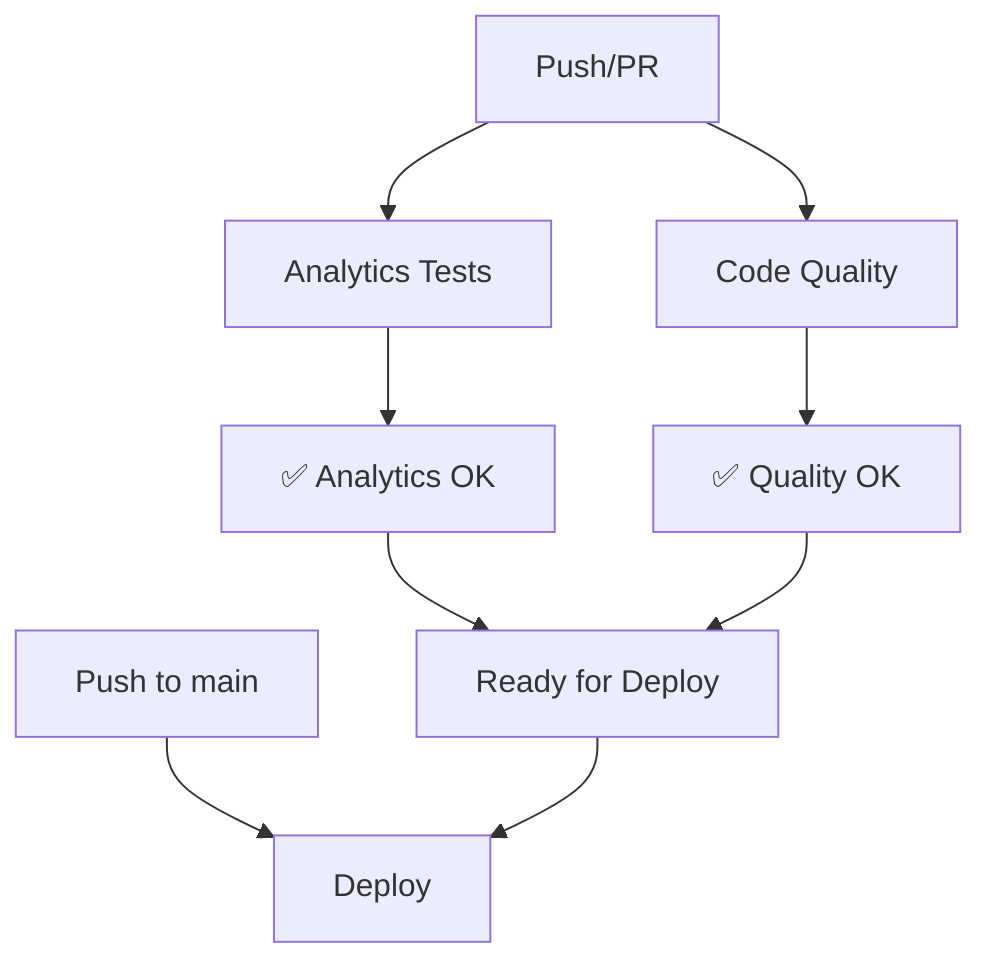

# 🚀 GitHub Actions Workflows

## 📋 Overview

The workflows have been optimized to be smaller, faster, and run concurrently when possible.

## 🔧 Available Workflows

### 1. **Analytics Tests** (`test.yml`)

**Triggers**: Push to any branch, PRs to main, manual execution

**Function**: Validates the analytics system

- ✅ Verifies required files
- ✅ Validates AnalyticsService structure
- ✅ Tests development utilities
- ✅ Confirms documentation presence

**Duration**: ~2-3 minutes

### 2. **Code Quality** (`lint.yml`)

**Triggers**: Push to any branch, PRs to main, manual execution

**Function**: Code quality checks

- ✅ Type checking (TypeScript/Svelte)
- ✅ Configuration generation test
- ✅ Documentation structure verification

**Duration**: ~2-3 minutes

### 3. **Deploy** (`deploy.yml`)

**Triggers**: Push to main branch, manual execution

**Function**: Build and deploy to GitHub Pages

- ✅ SvelteKit application build
- ✅ Artifact upload
- ✅ Automatic deploy to GitHub Pages

**Duration**: ~4-5 minutes

## ⚡ Implemented Optimizations

### Parallel Execution

- **Analytics Tests** and **Code Quality** run in parallel
- Independent of each other, faster results

### Focused Workflows

- Each workflow has specific responsibility
- Facilitates debugging and maintenance
- Job reusability

### Smart Triggers

- **Tests**: Any branch/PR (fast feedback)
- **Deploy**: Main only (controlled production)

## 📊 Execution Flow

## 🎯 Benefits

- **Speed**: Smaller and focused workflows
- **Parallelism**: Simultaneous execution when possible
- **Clarity**: Well-defined responsibilities
- **Efficiency**: Less total execution time
- **Maintainability**: Easy debugging and updates

## 🔍 Monitoring

All workflows include:

- Informative logs with emojis
- Prerequisites validation
- Clear status reports
- Visual progress indicators
