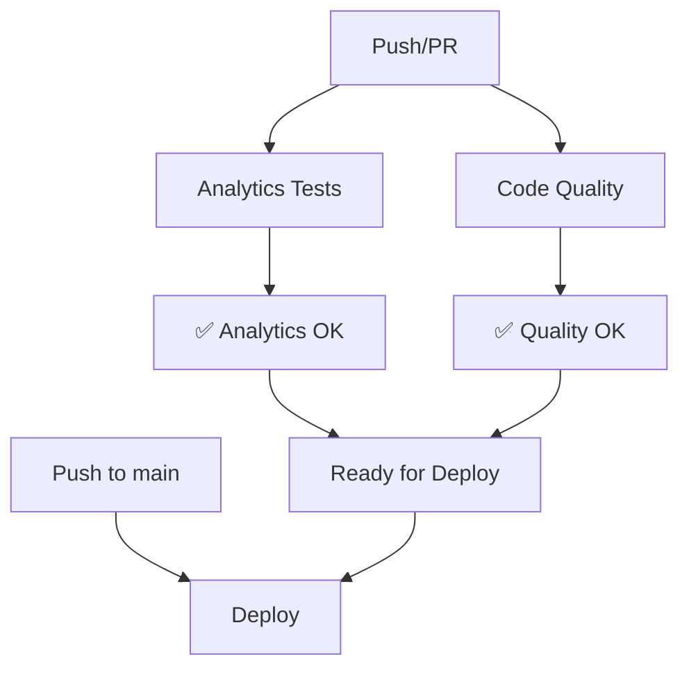

# 🚀 Workflows do GitHub Actions

## 📋 Visão Geral

Os workflows foram otimizados para serem menores, mais rápidos e executados concomitantemente quando possível.

## 🔧 Workflows Disponíveis

### 1. **Analytics Tests** (`test.yml`)

**Executa**: Push em qualquer branch, PRs para main, execução manual

**Função**: Valida o sistema de analytics

- ✅ Verifica arquivos necessários
- ✅ Valida estrutura do AnalyticsService
- ✅ Testa utilitários de desenvolvimento
- ✅ Confirma presença da documentação

**Duração**: ~2-3 minutos

### 2. **Code Quality** (`lint.yml`)

**Executa**: Push em qualquer branch, PRs para main, execução manual

**Função**: Verificações de qualidade de código

- ✅ Type checking (TypeScript/Svelte)
- ✅ Teste de geração de configuração
- ✅ Verificação da estrutura da documentação

**Duração**: ~2-3 minutos

### 3. **Deploy** (`deploy.yml`)

**Executa**: Push na branch main, execução manual

**Função**: Build e deploy para GitHub Pages

- ✅ Build da aplicação SvelteKit
- ✅ Upload dos artefatos
- ✅ Deploy automático para GitHub Pages

**Duração**: ~4-5 minutos

## ⚡ Otimizações Implementadas

### Execução Paralela

- **Analytics Tests** e **Code Quality** executam em paralelo
- Independentes entre si, resultado mais rápido

### Workflows Focados

- Cada workflow tem responsabilidade específica
- Facilita debug e manutenção
- Reutilização de jobs

### Triggers Inteligentes

- **Testes**: Qualquer branch/PR (feedback rápido)
- **Deploy**: Apenas main (produção controlada)

## 📊 Fluxo de Execução

## 🎯 Benefícios

- **Rapidez**: Workflows menores e focados
- **Paralelismo**: Execução simultânea quando possível
- **Clareza**: Responsabilidades bem definidas
- **Eficiência**: Menos tempo total de execução
- **Manutenibilidade**: Fácil debug e atualização

## 🔍 Monitoramento

Todos os workflows incluem:

- Logs informativos com emojis
- Validação de pré-requisitos
- Relatórios de status claros
- Indicadores visuais de progresso
